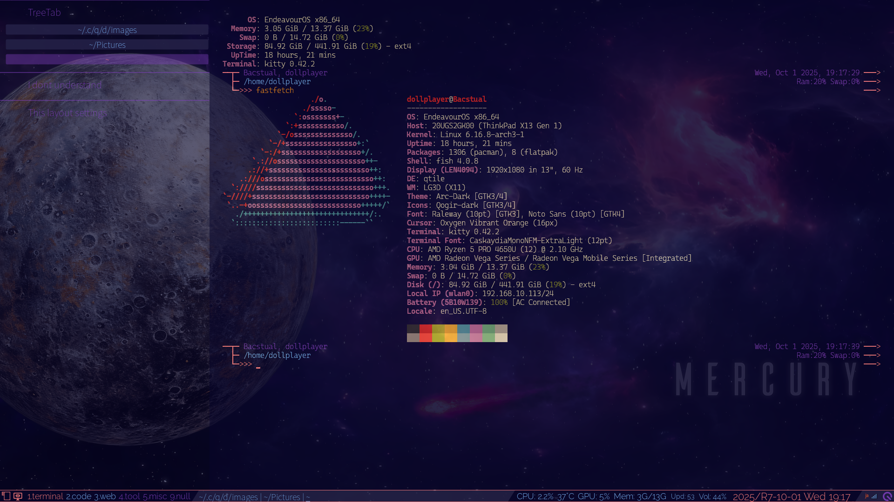

# Screenshot

Here I will only upload the most common layouts that I use.  
The color scheme I use does not use any of the various existing color schemes. I use the typical color scheme used in EndeavorOS's Xfce4-terminal. See [`./modules/Theme_Colors_EndeavourOS_Xfce4.py`](../modules/Theme_Colors_EndeavourOS_Xfce4.py) for this.

## TreeTab

&nbsp;

This is the basic layout when I use the terminal. There are many parts where I don't understand the settings or behavior.

## VerticalTile

&nbsp;

The layout arrangement is quite different when using one window and when using multiple windows.

## Layouts other than those listed above

I don't think there's anything particularly noteworthy. For more information about layout configuration, see [`./modules/layouts.py`](../modules/layouts.py).

<!-- -->

