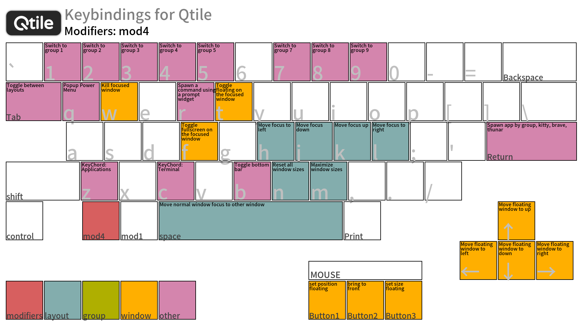
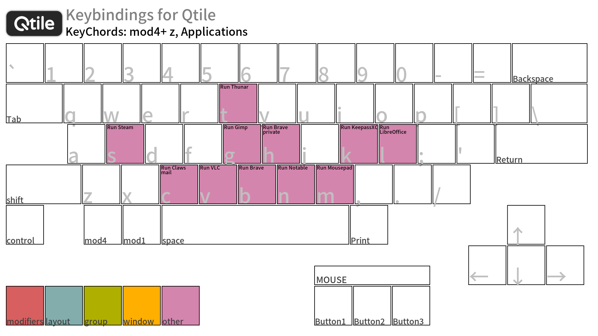

# Modification of `gen-keybinding-img`

&nbsp;


## Overview

If you have set a key binding that includes [KeyChord](https://docs.qtile.org/en/stable/manual/config/keys.html#keychord), [`gen-keybinding-img`](https://github.com/qtile/qtile/blob/master/scripts/gen-keybinding-img) may crash. I have made some minimal modifications to avoid this. However, there are the following limitations:

- Key bindings with more than two strokes are not supported (probably, unconfirmed)
- Even if multiple key combinations are assigned to the second stroke, only alphabet keys are recognized.  
Specifically, it works when you press `Super`+`z` to start KeyChord, then press `s` to launch an application. However, if you press `Super`+`z`, followed by `Shift`+`s`, it recognizes the `s` key, but not the `Shift` key.
- Regarding this modification, I have introduced Qtile with `yay`, so I cannot take any action such as a pull request to the Qtile development team.

Meanwhile, I've made the following improvements:

- Expanded the screen size to 1920x1080
- Fixed font settings (size and color)


## Preparing to run `gen-keybinding-img`

As I mentioned earlier, I use Qtile with `yay`. Because of this, `gen-keybinding-img` usually doesn't start. To avoid this, I've taken the following steps:

- Symbolically link `/usr/bin/qtile` to `~/.config/qtile/bin/`
- Download [`logo.png`](https://github.com/qtile/qtile/blob/master/libqtile/resources/logo.png) to `~/.config/qtile/`
- Create the `~/.config/qtile/keybind-map/` directory (to store images)
- Obtain `gen-keybinding-img` and store it in `~/.config/qtile/scripts/`

After setting the above, the directory structure will be as follows:

```
~/.config/qtile/
 ├─ bin/
 │   └─ qtile@ > /usr/bin/qtile
 ├─ keybind-map/
 │   └─ *.png
 ├─ scripts/
 │   ├─ gen-keybinding-img
 │   └─ gen-keybinding-img.sh
 ├─ config.py
 └─ logo.png
```

The actual startup is performed by [`~/.config/qtile/scripts/gen-keybinding-img.sh`](../scripts/gen-keybinding-img.sh).

```
#!/usr/bin/sh
python3 ~/.config/qtile/scripts/gen-keybinding-img \
  --config ~/.config/qtile/config.py \
  --output-dir ~/.config/qtile/keybind-map/
```


## Personal opinion

Personally, I would be extremely grateful for the existence of a tool that can display key bindings as images rather than as list-style strings. This would allow me to intuitively recognize key bindings. However, it seems that this functionality probably does not exist in other tiling window managers. If possible, I would like to implement the following solution in the form of what is known as "program division." (If I have the time and energy)

1. Analyze key bindings and save the settings as a unified output JSON file.
2. Load the JSON file and display it in a keyboard image.

The problem here is that I don't have the skills to modify the `gen-keybinding-img` script, so it's difficult for me to do so. I know this is a little late to mention, but Qtile runs on Python. This means that it doesn't simply parse a string to get the list of key bindings, but retrieves them via the Qtile API. Analyzing this process is a lot of work for me.

I understand that there are many different keyboard layouts, even though we use the word "keyboard." Let's put that aside for now. Actually, I don't use this keyboard layout when it comes to symbols. At the very least, the special keys, numbers, and alphabets are the same, but I still feel that it's a useful Python script (which actually runs Cairo).


<!-- -->
