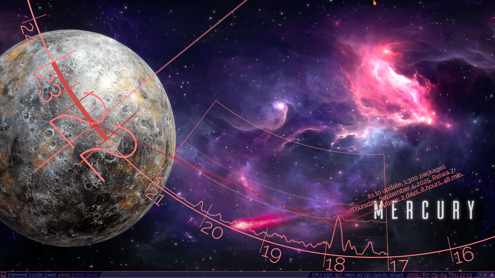
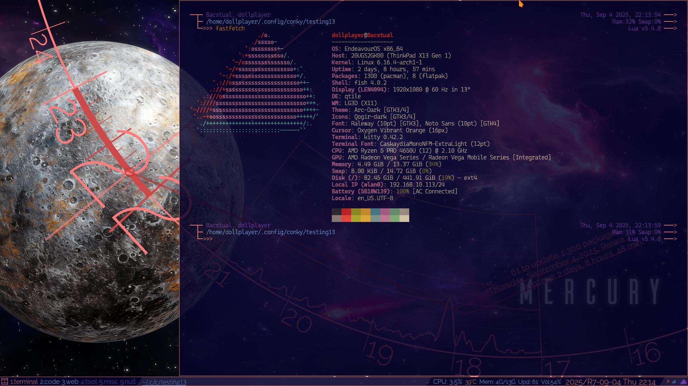

# Built-in Widgets


## Overview

Although I rarely use it, I configure Qtile for a dual-screen setup. The `./config.py` file, which is the starting point for launching and configuring Qtile's widgets, is shown below.

```
from modules.screens_bar import screens
```

And `./modules/screens_bar.py` is as follows.

```
from modules.screens_bar__main import screen_main
from modules.screens_bar__sub_01 import screen_sub_01

screens = [
  screen_main,
  screen_sub_01,
]
```

For example, `screen_main` (`./modules.screens_bar__main.py`) has common settings with another screen, `screen_sub_01` (such as PowerLine). To accommodate this, `./modules.screens_bar___common.py` is provided.

```
from modules.screens_bar___common import (
  common_powerline,
  common_config_screen,
  common_config_bar,
)
```

As for `./modules/screens_bar_none.py`, it is set to "do not display the bar." The import setting is left commented out in `./config.py`. It is almost never used, and currently it is set to be possible to toggle the display of the bar with `Super`+`b`.


## Dynamic Add/Delete Switch

You might be able to dynamically load/delete settings under Add/Delete on the second screen, but this isn't currently implemented.


## Explicitly indicate which screen you're currently on.

I think it's essential to implement [`libqtile.widget.CurrentScreen`](https://docs.qtile.org/en/stable/manual/ref/widgets.html#currentscreen).


## Personal Opinion

In any case, it may be difficult to operate two (or more) screens primarily through the keyboard. In this case, I think mouse operation is the clear winner.

Also, my Conky theme development has stopped for now, and there is also the issue of how to separate the information displayed by this and the Qtile widgets.

&nbsp;


<!-- -->
