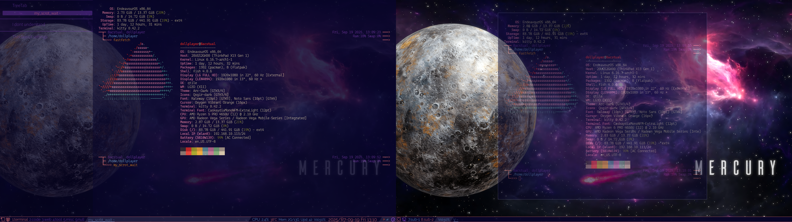
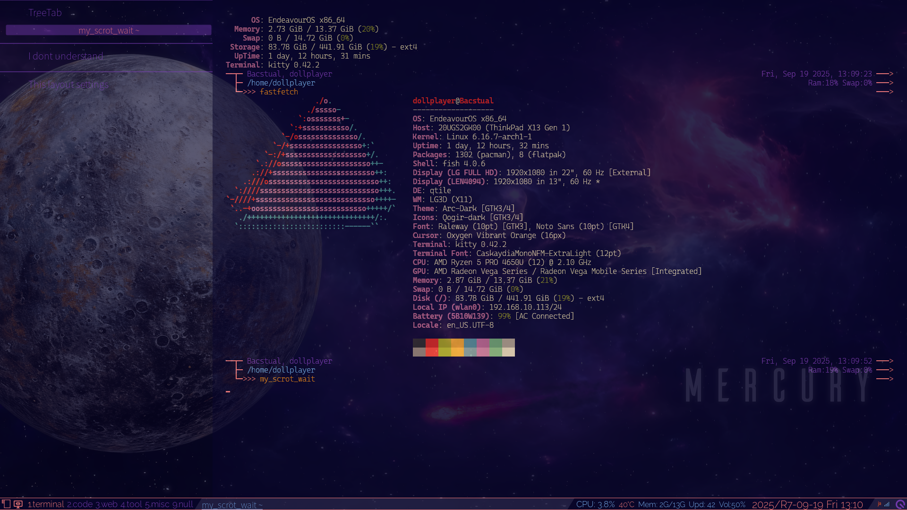
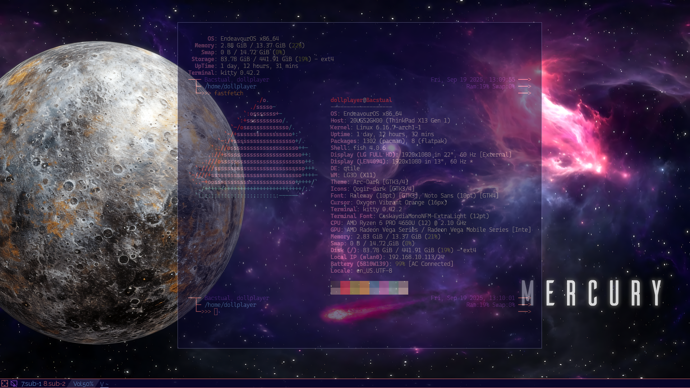

# Taking a screenshot


I use `scrot` by wrapping it in a Fish shell function. Since I haven't made the Fish shell dot file public, I've summarized it below. This is because if you take a screenshot of multiple screens with `scrot` without paying attention to the arguments, all screens will be output as a single image.

<br clear="all">
&nbsp;&nbsp;&nbsp;&nbsp;


The following script has the following restrictions:

- The image size for both screens is 1920x1080.
- The left side of the two screens is the main screen, and the right side is the sub screen.
- The two screens are adjacent at the same edge height.

```
function my_scrot_now -d "Scrot now"
  set --local line (xrandr --listmonitors | head -n 1)
  set --local parts (string split ' ' $line)
  set --local monitors $parts[2]

  set --local year  (date +%Y)
  set --local month (math (date +%m))
  set --local day   (math (date +%d))
  set --local hour  (math (date +%H))
  set --local min   (math (date +%M))
  set --local sec   (math (date +%S))
  set --local filename_10 (printf "EndeavourOS_Qtile_%04d-%02d-%02d_%02d-%02d-%02d.png"   $year $month $day $hour $min $sec)
  set --local filename_20 (printf "EndeavourOS_Qtile_%04d-%02d-%02d_%02d-%02d-%02d_0.png" $year $month $day $hour $min $sec)
  set --local filename_21 (printf "EndeavourOS_Qtile_%04d-%02d-%02d_%02d-%02d-%02d_1.png" $year $month $day $hour $min $sec)
  set --local filename_22 (printf "EndeavourOS_Qtile_%04d-%02d-%02d_%02d-%02d-%02d_2.png" $year $month $day $hour $min $sec)

  if test "2" = "$monitors"
    command scrot                     -z -p $filename_20 -e "mv \$f ~/Pictures/"
    command scrot -a    0,0,1920,1080 -z -p $filename_21 -e "mv \$f ~/Pictures/"
    command scrot -a 1920,0,1920,1080 -z -p $filename_22 -e "mv \$f ~/Pictures/"
  else
    command scrot -z -p $filename_10 -e "mv \$f ~/Pictures/"
  end
end
```

The Fish shell function, `my_scrot_now`, performs the following processing.

- Decide whether to use one screen or multiple screens
- When using one screen, create the following file:
  - `EndeavourOS_Qtile_yyyy-mm-dd_hh-nn-ss.png`
- When using multiple screens (two screens), create the following files:  
File names ending with `_0` are screenshots of multiple screens, `_1` are screenshots of the left screen, and `_2` are screenshots of the right screen.
  - `EndeavourOS_Qtile_yyyy-mm-dd_hh-nn-ss_0.png`
  - `EndeavourOS_Qtile_yyyy-mm-dd_hh-nn-ss_1.png`
  - `EndeavourOS_Qtile_yyyy-mm-dd_hh-nn-ss_2.png`
- Move files to `~/Pictures`

I also added a function that calls the above function to take a screenshot after 10 seconds (it also beeps after 10 seconds).

```
function my_scrot_wait -d "Scrot wait 10 seconds"
  command sleep 10
  my_scrot_now
  echo -e "\a"
end
```

The above two functions are set as key bindings for Qtile.

```
Key(['mod4', 'control'], 'p', lazy.spawn("fish -c 'my_scrot_now'"),  desc = 'Print screen now'),
Key(['mod4', 'control'], 'i', lazy.spawn("fish -c 'my_scrot_wait'"), desc = 'Print screen after 10 sec'),
```


<!-- -->
