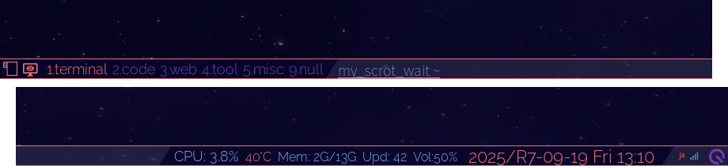
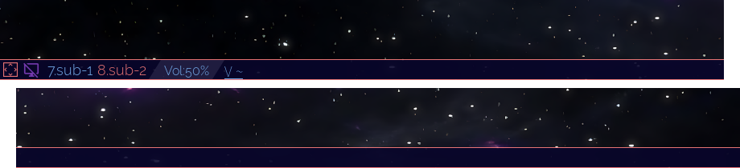

# Multiple Sscreens

My conclusion is that handling multiple screens with Qtile requires some customization. To be honest, although the main advantage of a tiling window manager is keyboard-driven operation, I find using the mouse much easier.

## `widget.CurrentScreen`

I think using `widget.CurrentScreen` is essential. Because at the very least, I wanted to be able to clearly see which screen was currently in focus.

I think it might be possible to turn off this widget when using only one screen. For example, you could implement a new class that inherits this widget. However, I haven't implemented it yet.

&nbsp;

The second icon on the left side of each screen is the display result of this widget. The image on the left is the screen where the cursor is currently located.

## Taking screenshot

See [Taking a screenshot](./08_02-taking-screenshot.md). This is because using `scrot` makes taking screenshots of multiple screens a bit tedious.

<!-- -->
