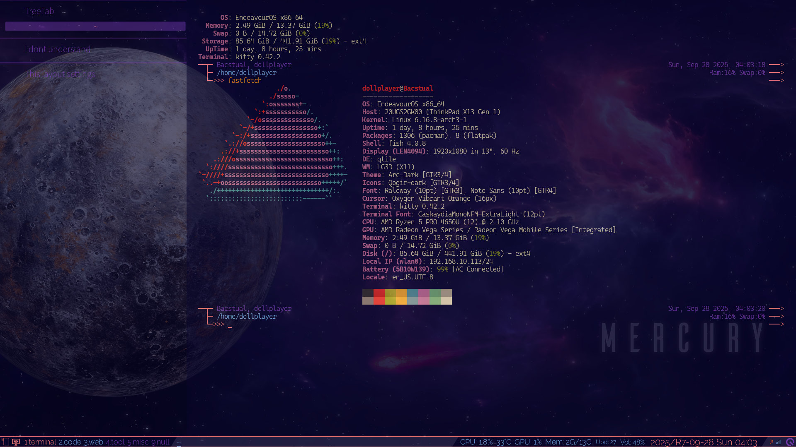
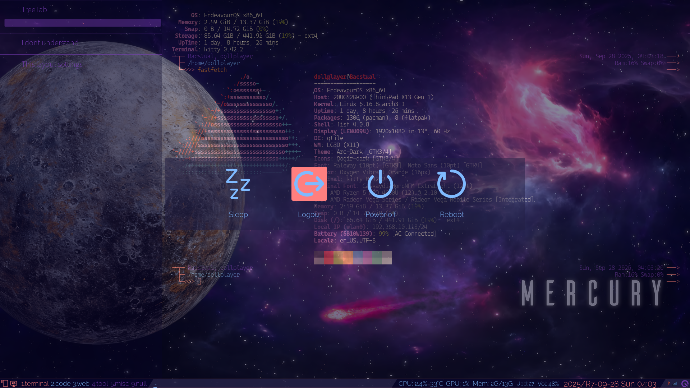

# dollplayer2501/dotfiles_qtile: My Qtile's configuration files

&nbsp;

## Overview

This is the documentation for [dollplayer2501/dotfiles_qtile: My Qtile's configuration files](https://github.com/dollplayer2501/dotfiles_qtile).  
This Qtile configuration included here contains the following:

- Splitting the configuration files
- A modified version of gen-keybinding-img with partial support for two-stroke KeyChords
- Usage of the Popup Toolkit
- Support for up to two monitors
- Regarding the color scheme, instead of using an existing theme, I use the color settings from EndeavourOS’s Xfce4 terminal

The configurations of tools supporting my Qtile window manager are as follows:

- [kitty terminal](https://github.com/dollplayer2501/dotfiles_kitty)
- [Starship](https://github.com/dollplayer2501/dotfiles_starship)
- The following are in private repositories:
  - Fish shell
  - Picom
  - Fastfetch
  - Bat
  - Ranger
  - LazyVim
  - Conky

## Table of contents

<!-- {{TOC-IN}} -->
- [Project Overview](./01_00-overview.md)
- [File Structure](./02_00-files.md)
- [Installation](./03_00-installing.md)
- [Built-in Layouts](./04_00-layout.md)
  - [Screenshot](./04_01-screenshot.md)
- [Keybindings](./05_00-keybind.md)
  - [Modification of `gen-keybinding-img`](./05_01-gen-keybinding-img.md)
- [Built-in Widgets](./06_00-widgets.md)
- [Multiple Sscreens](./07_00-multiple_screens.md)
- [Other information](./08_00-other-information.md)
- [Functions that were used but are no longer used](./09_00-unused-features.md)
<!-- {{TOC-OUT}} -->

<!-- -->
